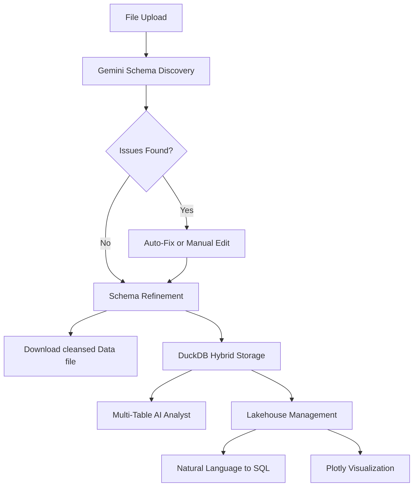

# Intelligent Lakehouse Adapter & Analyst

## Overview

**Intelligent Lakehouse Adapter & Analyst** (formerly Universal Data Adapter) is a production-ready AI-powered data platform that automatically discovers schemas, cleans data, and enables natural language querying across any data source. It bridges the gap between raw data and actionable insights using a hybrid SQL/NoSQL lakehouse architecture.

## 🎯 Key Features

### 1. **Universal Data Ingestion**
- Accepts ANY file format: Images (JPG/PNG), CSV, JSON, Text
- AI-powered schema discovery using Gemini
- Automatic data type detection
- Real-time file preview before processing

### 2. **AI-Driven Data Quality**
- Automatic issue detection (mixed formats, missing values, typos)
- ✨ **Auto-Fix** button - Gemini corrects issues automatically
- Human-in-the-loop refinement (edit schema & data before loading)

### 3. **Hybrid Storage (SQL + NoSQL)**
- **Structured columns** for fast analytics
- **`raw_data` JSON column** for complete data preservation
- Dynamic schema evolution (adds new columns automatically)
- DuckDB-powered analytics engine
- **Session Isolation**: Unique database files per user session for security

### 4. **Multi-Table AI Analyst**
- Natural language queries across multiple tables
- Automatic join detection with visual indicators
- Real-time SQL generation and execution
- **Instant Visualizations**: Automatically generates Plotly charts from query results

### 5. **Data Lakehouse Management**
- View all tables with row counts
- Inspect schemas interactively
- Delete individual tables or clear all
- Tab-based UI for easy navigation

## 🏗️ Architecture



## 📂 Project Structure

```
intelligent_data_lakehouse_project/
├── app.py                    # Main Streamlit UI (Intelligent Lakehouse Adapter & Analyst)
├── modules/                  # Modularized Logic
│   ├── database.py          # DatabaseManager (DuckDB operations)
│   ├── chat_handler.py      # ChatHandler (AI & Visualization)
│   ├── data_processor.py    # Export utilities
│   └── ui_components.py     # Reusable UI widgets
├── etl_logic.py             # AI Extraction & Cleaning Logic
├── config.py                # Configuration
├── .env                     # API keys
├── requirements.txt         # Python dependencies
├── Dockerfile               # Container definition
├── docker-compose.yml       # Orchestration
├── .gitignore              # Git ignore rules
└── README.md                # Documentation
```

## 🚀 Deployment

### Option 1: Docker (Recommended)
```bash
docker-compose up --build
# Opens on http://localhost:8501
```

### Option 2: Virtual Environment
```bash
# Windows
setup_venv.bat

# Mac/Linux
chmod +x setup_venv.sh && ./setup_venv.sh
```

## 🎮 User Flow

### Ingest Tab
1. **Select Sample** or upload file
2. **Preview** file contents (image/CSV/JSON)
3. **Analyze** - Gemini extracts schema
4. **Auto-Fix** data quality issues (if any)
5. **Edit** data/schema as JSON
6. **Approve & Load** to lakehouse

### Manage Tab
- View all tables with metrics
- Inspect schemas
- Delete individual tables
- **Clear All** button wipes lakehouse

### AI Analyst Tab
- **Multi-select** tables to query
- View **Join Analysis** (shows common columns)
- Ask questions in natural language (e.g., "Show sales by region")
- Get **SQL queries**, **Natural Language Answers**, and **Interactive Charts**

## 🧪 Sample Files

Three built-in samples for testing:
1. **📄 Invoice** - Tests image OCR
2. **📊 Sales Report** - Tests messy CSV (mixed date formats)
3. **📦 Inventory** - Tests nested JSON

## 🛠️ Tech Stack

- **Frontend**: Streamlit (tab-based UI)
- **GenAI**: Google Gemini 1.5 Flash
- **Database**: DuckDB (OLAP)
- **Orchestration**: LangChain
- **Schema**: Dynamic Pydantic generation
- **Deployment**: Docker + Compose
- **Visualization**: Plotly Express

## 🔐 Configuration

Edit `.env`:
```
GOOGLE_API_KEY=your_key_here
GEMINI_MODEL_NAME=gemini-1.5-flash  # or gemini-1.5-pro
```
